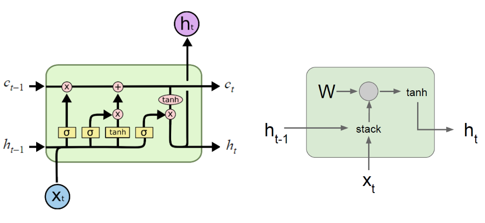

# RNN

# 1. Vanilla Recurrent Neural Network

* **Architecture overview**

* **The computation inside one single RNN cell**

* **Numpy implementation (only forward propagation)**
import numpy as np

# One step forward propagation
def step_forward(x, h, s, w, b):
    """
    x: input vector for one time step, 1 x n_features
    h: hidden state from last time step, 1 x s
    s: hidden size, this is a hyper-parameter
    w: weights
    b: biases
    """
    
    # 1. concatenation
    concated = np.concatenate([h, x], axis=-1)
    
    # 2. mutiplication and addition
    mul_add = np.dot(concated, w) + b
    
    # 3. activation
    output = np.tanh(mul_add)
    
    return output
    
 s = 5
n_features = 2

x = np.random.randn(1, n_features) # one time step
h = np.random.randn(1, s)

w = np.random.randn(s + n_features, s)
b = np.zeros((1, s))

step_forward(x, h, s, w, b)

def forward(x, h, s, w, b):
    """
    x: input sequence for one sample, shape: time_steps x n_features
    h: hidden state
    s: hidden size
    w: weights
    b: biases
    """
    steps = len(x)
    
    for t in range(steps):
        xt = x[t, :]
        xt = np.reshape(xt, (1, -1))
        if t==0:
            ht = h
        ht = step_forward(xt, ht, s, w, b)
    
    return ht
    
 s = 5
time_steps = 3
n_features = 2

x = np.random.randn(time_steps, n_features)
h0 = np.zeros((1, s)) # the hidden state at t=0

w = np.random.randn(s + n_features, s)
b = np.zeros((1, s))

forward(x, h0, s, w, b)

# 2. Long Short Term Memory (LSTM)

* **Where are the weights?**
  * W_f: weights at forget gate
  * W_i: weights at input gate
  * W_o: weights at output gate
  * W_t: weights at tanh layer
  

# Reference:
1. https://www.youtube.com/watch?v=WCUNPb-5EYI&list=PLVAZfAcOWsEBxKXOo49qrWfMvmOiSEL_I
2. http://colah.github.io/posts/2015-08-Understanding-LSTMs/
3. https://www.youtube.com/watch?v=9zhrxE5PQgY
4. https://www.youtube.com/watch?v=8HyCNIVRbSU
5. https://www.youtube.com/watch?v=iX5V1WpxxkY&t=3746s
6. https://arxiv.org/pdf/1503.04069.pdf
7. http://slazebni.cs.illinois.edu/spring17/lec03_rnn.pdf
8. http://web.stanford.edu/class/cs224n/lectures/lecture8.pdf
9. http://www.wildml.com/2015/09/recurrent-neural-networks-tutorial-part-1-introduction-to-rnns/
10. http://www.deeplearningbook.org/contents/rnn.html
